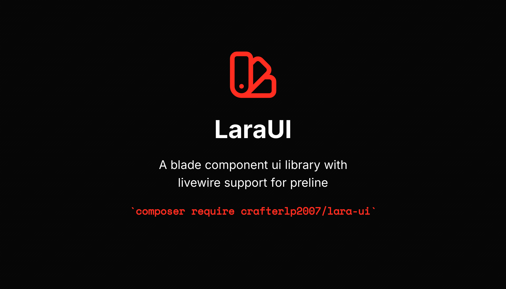

<p align="center">  
      
</p>  
<h1 align="center">LaraUI</h1>  
<p align="center">A blade component ui library with livewire support for <a href="https://preline.co"></a>preline</p>  

<p align="center">  
    <br />  
    <a href="https://lara-ui.de">🌐 Website</a>  
    ·  
    <a href="https://github.com/CrafterLP2007/LaraUI?tab=readme-ov-file#-documentation">📖  Documentation</a>  
    ·  
    <a href="https://github.com/CrafterLP2007/LaraUI?tab=readme-ov-file#-todo">📋  Todo</a>  
</p>  

<p align="center">  
  <a href="https://skillicons.dev">  
      
  </a>  
</p>  

```bash  
composer require crafterlp2007/lara-ui
```  

## 📖 Documentation
Not available yet.

## 📖 Todo
The following components are in development:

- [ ] Datepicker
- [ ] Timepicker
- [ ] Advanced Select
- [ ] Modal

## 📝 License
This project is licensed under the MIT License - see the [LICENSE](LICENSE) file for details.
